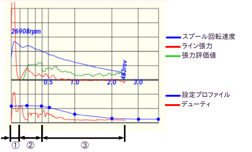
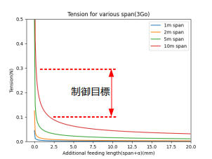
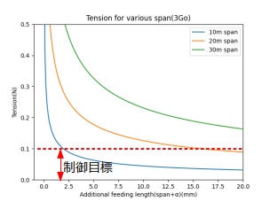
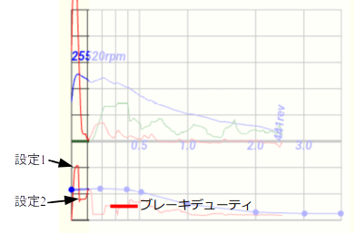
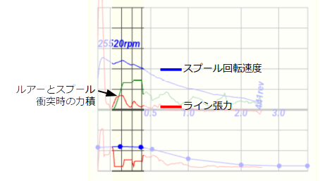
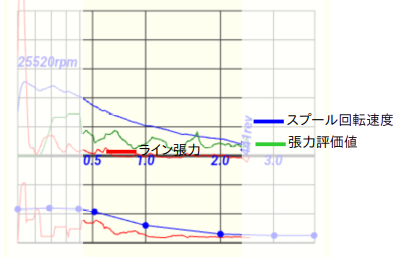

# キャスティング制御設計

## 概略設計

### 系の状態分類
ルアー・ライン・スプールで構成されるリール系の、キャスト時の状態を以下の３状態に分類する。
<table>
<tr><td>
① 加速状態  0〜0.1秒 
② スパン(1)小状態  0.1〜0.4秒 
③ スパン大状態  0.4秒〜
<td>

</table>

<dl>
<dt> 注1)スパン</dt>
<dd>ルアーとロッド間の距離。放出されたラインは懸垂線を描くが、スパンが短い(図左下)ほどラインスラックに対する張力変化が非常に大であり、張力が安定化しにくい。一方、スパンがある程度大きくなると(図右下)、勾配は一気に緩やかになり、張力は自然に安定する。</dd>
<dd>
<table>
<tr><td><td></tr>
</table>
</dd>
</dl>

### 状態ごとの設計指針
<table>
<tr><th>状態<th>①<th>②<th>③</tr>
<tr><th>区間<td>経過時間<0.1sec スパン(1)<2.0m<td>経過時間<0.4sec スパン<10.0m<td>経過時間>0.4sec スパン>10.0m</tr>
<tr><th>説明<td>キャスト力がライン張力を発生し、スプールを加速している状態。
<td>ルアーとスプールがラインを介した連成系となる状態。初期状態で両者の速度は必ずしも一致していない。またスパン小のため懸垂線による張力安定効果も期待できない。
<td>スパンが大きくなり、懸垂線による張力安定が効いている。
</tr>
<tr><th>方針<td>ノーブレーキ(力弱) スプール速度オーバーラン(2)防止(力強)<td>高めの張力目標値 高応答の制御<td>張力目標値ほぼゼロ 張力の強さは振動強度で表す</tr>
</table>

<dl>
<dt> 注2)スプール速度オーバラン</dt>
<dd>スプール速度がルアー速度を上回ること。初速の低い軽いキャストでは、ルアー速度とスプール速度の一致状態が保たれるが、初速を上げようとすると、力を込めるとスプール速度がルアー速度を上回る。このままの状態で②状態に移ると、即時にバックラッシュやライン切れが起きる。
</dl>

## 詳細設計
### 状態①加速  
#### 要求実現
<dl>
<dt>1. 低初速(初速が閾値以下)では、スプールの回転を阻害しないよう、ブレーキは完全OFF</dt>
<dd>例えば、スプール回転15000RPM以下ではブレーキOFF</dd>
<dt>2. 高初速(初速が閾値以上)では、強いブレーキを作用しスプール回転を抑制</dt>  
<dd>スプール回転がルアー速度を超えると、致命的なバックラッシュやライン切れが発生しやすい</dd>
<dt>初速の高低により、サブ状態を以下のように切り替える。</dt>
<dd>
<table>
<tr><th rowspan="2">サブ状態<th colspan="2">遷移条件
<tr><th>低初速<th>高初速<th>ブレーキ<td rowspan="4">
</tr>
<tr><th>1<td>張力&lt;閾値1<td>スプール回転速度&gt;閾値2<td>0</tr>
<tr><th>2<td rowspan="2" align="center">↓<td>張力&lt;閾値1<td>設定1</tr>
<tr><th>3<td>張力 - 張力極小値&gt;閾値3<td>設定2</tr>
</table>
</dd>
</dl>

<dl>
<dt>設定1</dt><dd>1回転のうちのブレーキ作動時間(FETターンオン時間)を指示する。ただし、センサーレスユニットの場合は、次の周期を予測し、その前にターンオフする必要がある。実際にターンオンする時間は次の1回転予測時間 <i>&Delta;t1</i> の6/7以下とするのがよい。</dd>

$$
\alpha=-\Delta t_0+\Delta t_{-1}\\
v_0=-\Delta t_0 \Delta t_0+\Delta t_{-1} \Delta t_{-1}+2 \Delta t_0 \Delta t_{-1}\\
d_0=\Delta t_0 \Delta t_{-1} (\Delta t_0+\Delta t_{-1})\\
\Delta t_1=\frac{v_0-v_0\sqrt(1+\frac{2 \alpha d_0}{v_0^2})}{\alpha}\\
or \\
\Delta t_1=\frac{d_0}{v_0}-\frac{\alpha d_0^2}{4v_0^3}   approx.
$$

<dt>設定2</dt><dd>設定プロファイル(3)に対する比率を設定する。概ね70〜100%</dd>
<dt>注3)設定プロファイル</dt><dd>ブレーキデューティの多点設定ポリライン
</dd>
</dl>

### 状態②スパン小  
#### 概要
状態①での制御が成功していれば、この状態の初期には
  - ルアー速度 > スプール速度

が成立している。上記速度条件では、必ずラインを介してルアーとスプールの衝突が起きる。張力波形には、この時発生する力積 *F&Delta;t* が観察されるため、条件成立を確認できる。

#### 要求実現  
1. スライディングモード制御  
$$
\sigma=(\beta-\beta_{REF})+\frac{D_{\Theta}\dot{\beta}}{\omega}
$$
スライディングモード制御は、&sigma;(スイッチング関数)の符号により２値に制御入力$U$を切り替える。
$$
U=\begin{cases}
U_{Low} & \sigma>0 &  低デューティ\\
U_{High} & \sigma<0 &  高デューティ
\end{cases}
$$
2. 高デューティ一のアダプテーション  
高デューティ一は設定プロファイル$U_{Prof}$を上限に、下式にてアダプテーションする。
$$
U_{High}=\begin{cases}
U_{Prof} - U_{Prof} S_{Adap} & S_{Adap}<S_{Lim}\\
U_{Prof} - U_{Prof} S_{Lim} & S_{Adap}>S_{Lim}
\end{cases}
$$
$$
\begin{cases}
S_{Lim}:アダプテーション上限値\\
S_{Adap}=k_{Adap} \Sigma \beta_{\sigma>0} \Delta t
\end{cases}
$$

### 状態③スパン大  
#### 概要
状態②での制御が成功していれば、適度なライン弛みが保たれている。この状態では、微修正を行うのみであるが、張力がほぼ０のため張力そのものでは誤差の影響が大きい。これを解消するため、張力の大きさをその振動強度によって表す。

#### 要求実現  
1. デューティ初期値  
2. デューティ補正  
BangBang制御(３値)

#### 張力振動強度フィルタ  
このフィルタの機能は、特定の周波数範囲の張力振動を数値化することである。周波数上限はオブザーバによって制限されるので、このフィルタはローカット機能のみである。
##### 高次式最適化によるローカット  
このフィルタのデータソースは、サンプリング区間(0.2〜0.3秒)の張力データである。